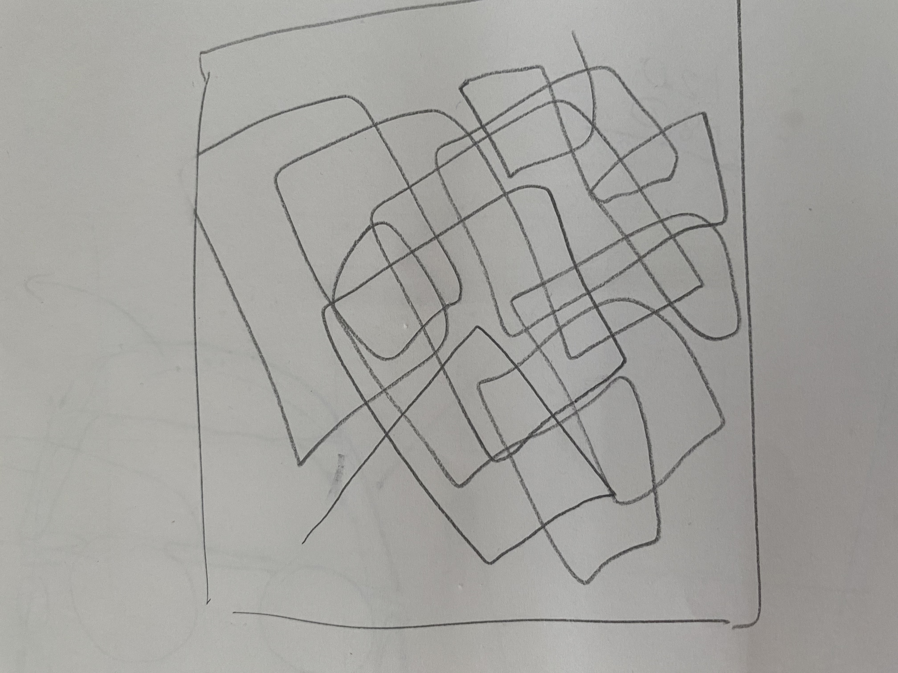
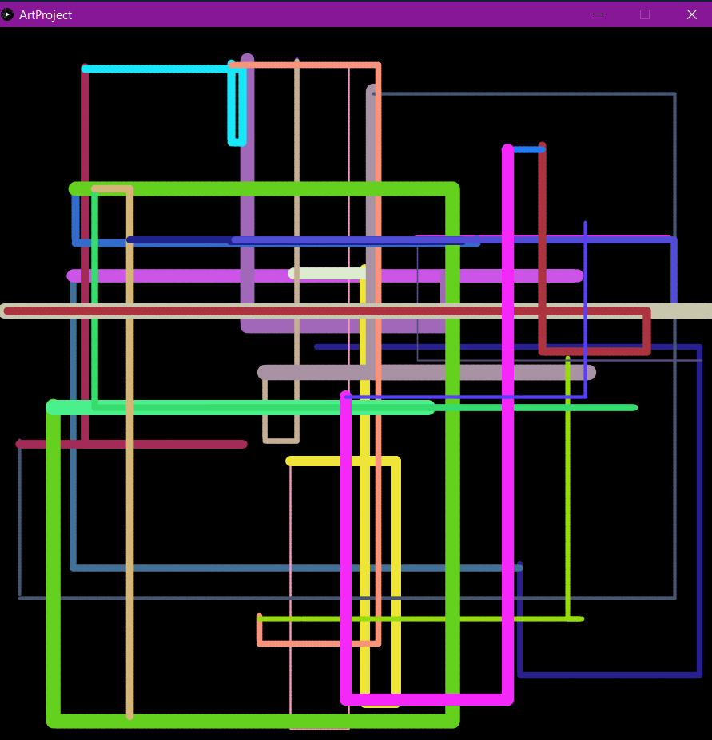
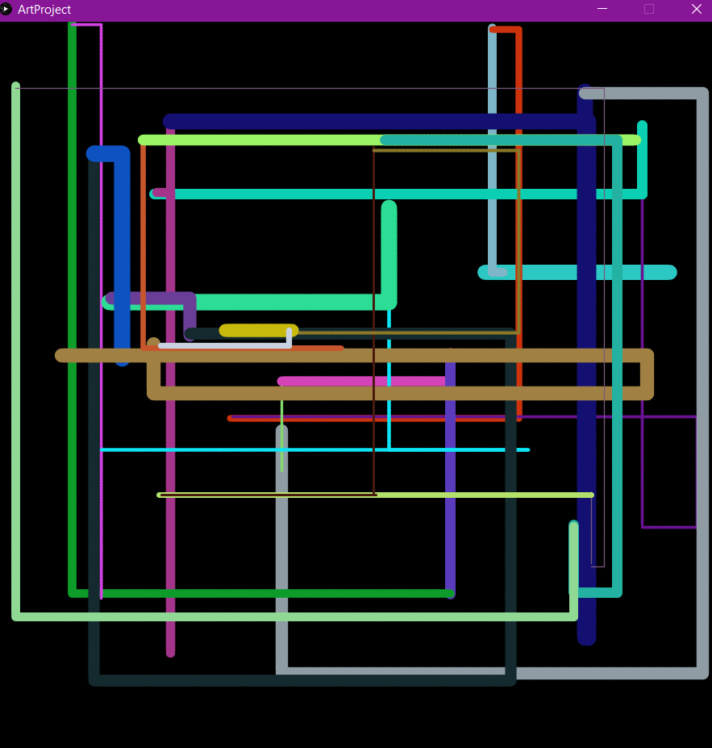
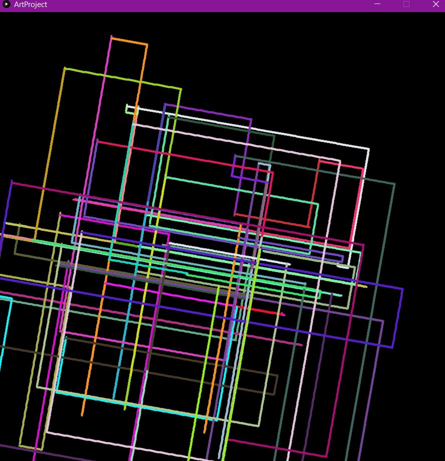
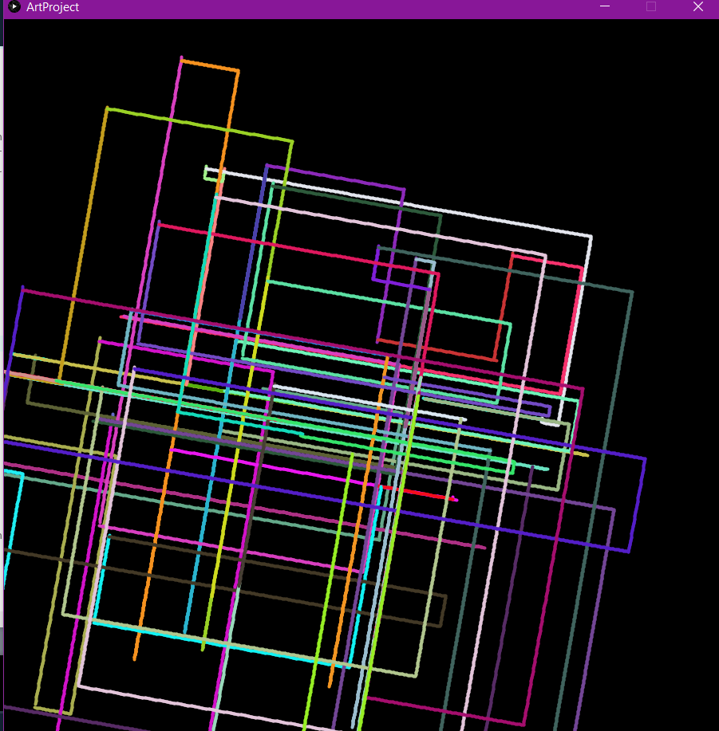
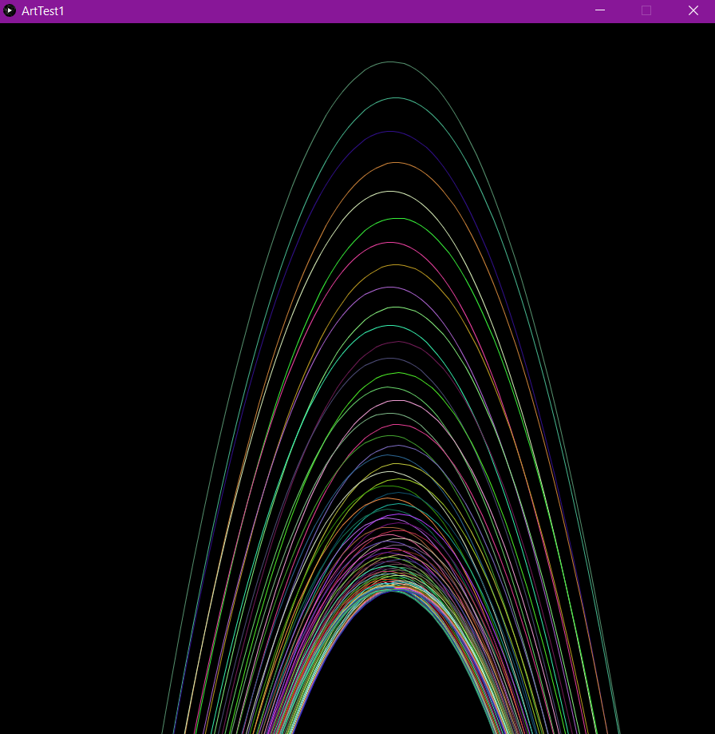

# June 1: Assignment 2

## Synopsis:

The task was to create a piece of art that used for/while loop and other code from the syntax we learnt so far. 

## What I did:
Based on the examples in given in the links, I was reminded of generative art and therefore tried to create a piece that was somewhat random and generative.

I made a sketch of what I had in mind and although there wasn't a requirement for the piece to be animated, based on the instructions I wanted my artwork to continuously change.

I accheived this by creating a generative art piece that refreshed once the mouse was clicked using the coordinates of where the mouse was clicked.

## Final product

Since the piece was mostly randomly generated and could be refreshed I took multiple screenshots and a video showing how it worked.

- Version 1: generating straight rectacngles

- Version 2: generating straight rectacngles

I also experiemented with using angled rectangles as this was my original vision

- Version 1: generating angled rectacngles

- Version 2: generating angled rectacngles

**Videos of the code running can be found** [**here**](https://www.youtube.com/watch?v=X4MiB5ymh3E&list=PLby9sGn7NkDsMAqRDQlPR8eJAiMGtrFSW)

## Challenges

This exercise was suprisingly challenging and took some time to debug. Overall, by using what we did in class both yesterday and today the task was quite doable. However I was reluctant to use conditional loops as I found that want I wanted to create could be used with if statements in the Draw Function. 

However, since the conditional states we are requirement I was able to integrate them and they proves quite useful. However, in doing so I lost the smoothness of my generated art. I later (after way more attempts than I'd like to admit) came to learn that this was because the Draw function compiles all subfunctions/instructions before executing them. As such by using the for loops I prevented myself from getting smooth lines as shown below:

[Video showing lines being drawn smoothly](https://youtu.be/S19czpiJNQc)

This version does not use For Loop and relies only on draw which loops infinitely allowing for a way smoother continuation of the line

Compared to my final product which can be found in the previous videos... these lines are drawn smoothly. However, in the large sceme of things it was a minor issue because at any given frame, both versions look smooth which was my ultimate goal.

vs

## Reflection:

This task give me the opportunity to play around with functions and conditionals. I feel more confident making functions and adding them to the main code. Moreover, I learnt something I never new before about the nature of the Draw Function which I know will be very useful in the future. 

