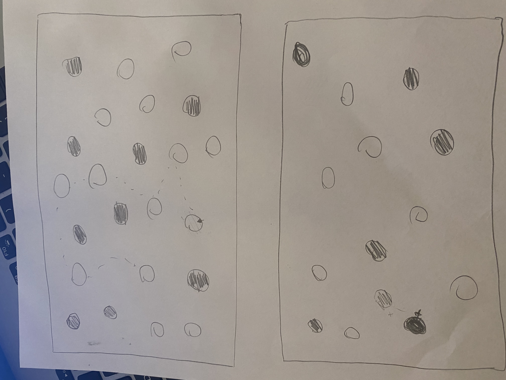
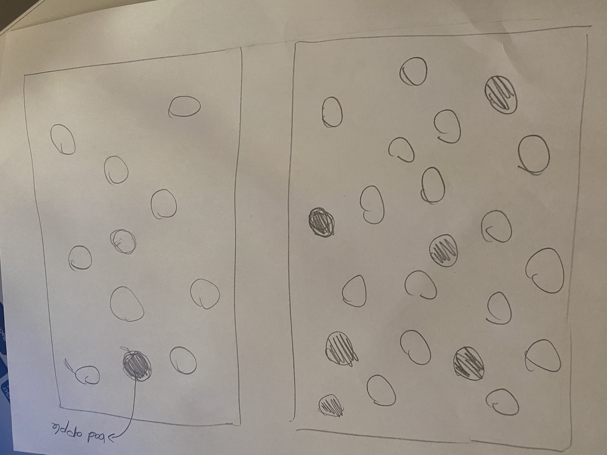
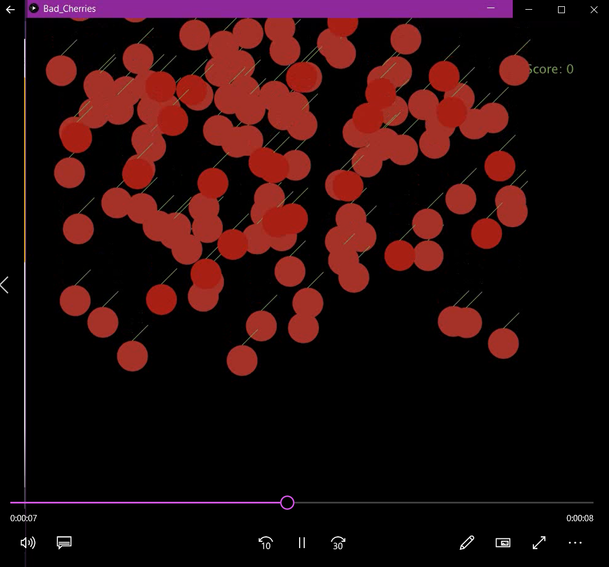
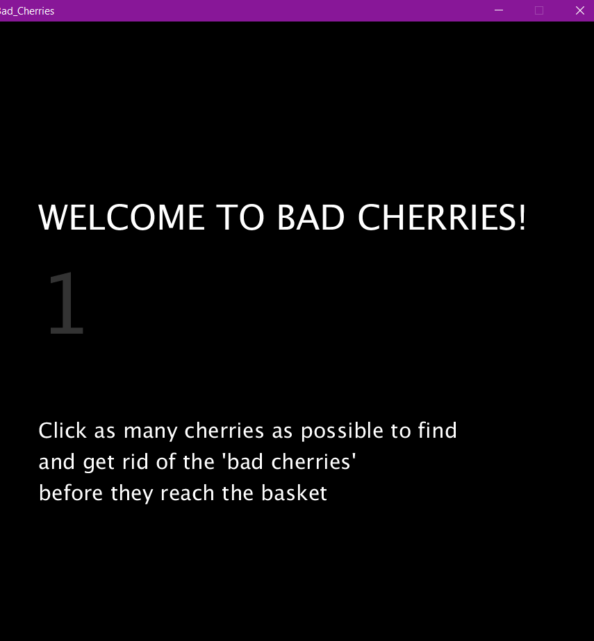
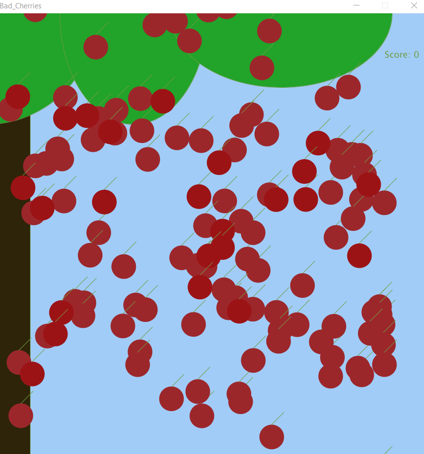
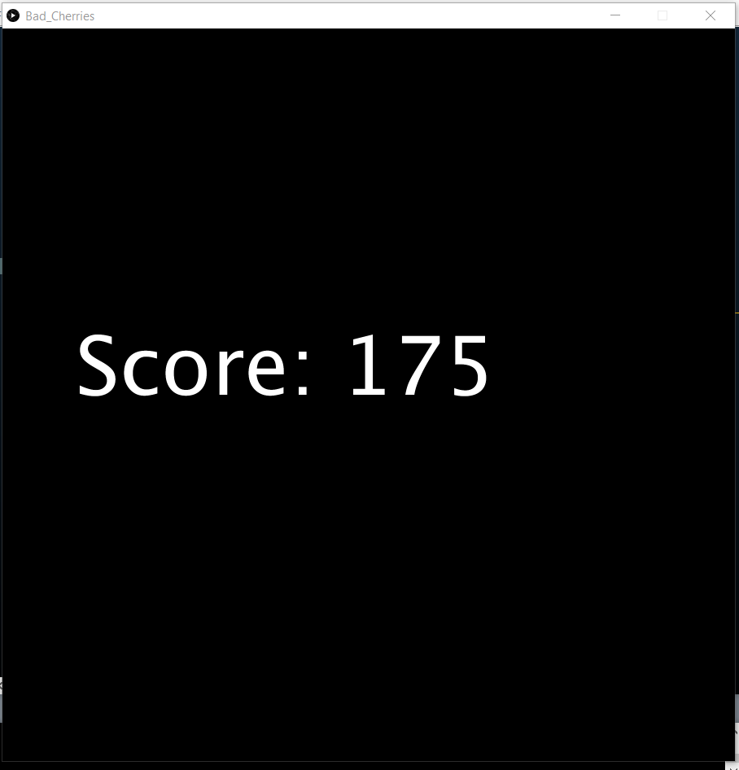

# June 3: Assignment 3

## Synopsis:

This assignment was to create a game or an artpiece that included a class

## What I did:

I decided to create a game called **Bad Cherries**. As evident by the name, the game shows a tree with falling cherries. However, the play needs to click as many of the 'bad cherries' as they could identify before time runs out. The more bad cherries you are able to throw away as the cherries fall to the hypotheical basket, the more points you earn.

The final video can be found [here](https://youtu.be/D8ZnmaZfdIo)

This project was not my initial idea but due to some challeneges which I will mention later on, I adapted accordingly.

My initial idea was to do a "Don't Touch the Balls" game where you had to click on the colored balls without touching the coloured balls. If you touched coloured balls you would earn a point but if you touched the white balls they would multiple causing more obstables and increasing the difficulty.

After trying this for a while I decided to change my approach and started along the 'bad apples' path. At this point I wanted to have the apples floating around with a single bad apple. The player had to safely drag the bad apple to the edge of the screen without touching the fresh apples. However if the longer they took the more bad apples would appear. 

;

However I modified yet again and landed on my final product 'BAD CHERRIES!'. This game comprised two classes one for good apples and one for bad apples which simplified the process as I would only be modifying one of the classes. Additionally, I liked the idea of the cherries falling down the screen and the game gradually became a task of speed rather than agility.

I got a user tester (Hatim) for my game and he provided me with some concrete feedback. Initially I only had the game internally keep score of the bad cherries pressed but Hatim suggessted that I find a way to notify the player that they've detected bad cherries which led to the 'throwing away of the detected bad cherries'.

A video of the initial user testing could be found [here]();

Finally, after smoothing out the details of the product I decided to make it more user friendly by adding instructions, creating a backgroud and printing the player's score so they could see.

## Challenges

I had two major problems when executing my code.:

- How to add delete objects from a class.
 
 Daniel Shifman's tutorials were really helpful and provided nifty ways to get around this problem. But when push came to shove, I could find a way to overcome this issue. Especially once I added more conditionals that just 'mousePressed()'. 
  This was one of the main reasons I changed from my first ideas. However once I shifted gears on my overall idea and had a clearer grasp on the classes I was able to get around this problem. Initially I tried to do this by making the bad cherries go black to blend into the screen.
 
  
  
However, as shown in the photo this wasn't very effective as this covered other good cherries. Instead I moved them off the canvas so that they 'appeared' to have been thrown away. This helped me avoid having to actually avoid the object. Nevertheless, I would like to learn how to modify a class in this manner and assume we will get to it later on in this class.

- Displaying the Welcome Page
 
 This was surprisingly frustrating because for a long time I did not understand the problem, I just knew it wasn't working. Like yesterday I learnt something new, that everything in setup function is executed before text is displayed. so even though I was adding a delay() function after my welcome message. It still only showed for a split second after the delay and just before moving on to the draw  function.
 
 I got around this issue by adding a countdown to the draw function that would only allow the game to start once the count down is completed. During this countdown I was able to display my welcome message.
 
 ## Reflections
 
 OOP is one of the area of programming which I have always felt less comfortable using and whereever I could tried to avoid it. However, the assignment gave me the opportunity to tackle OOP head on and I learned a lot from the experience. I have a much clear understanding of it and while this is tentative - I think I might even put it to use more often in the future!
