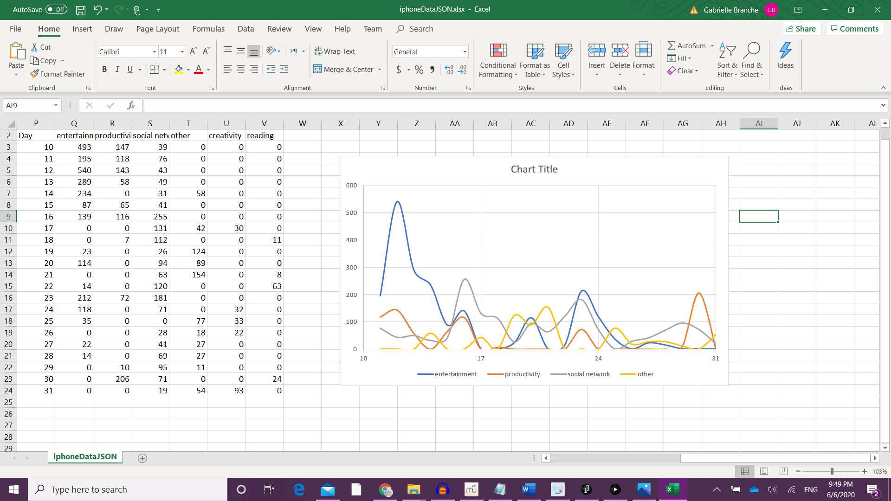
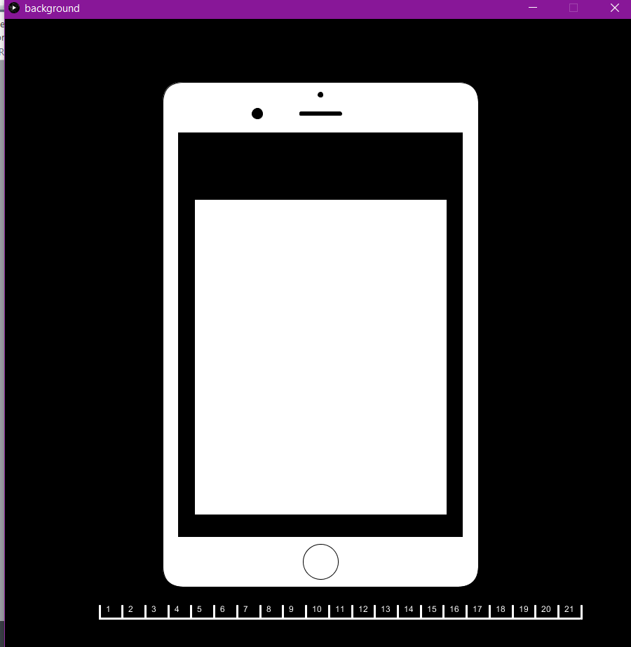
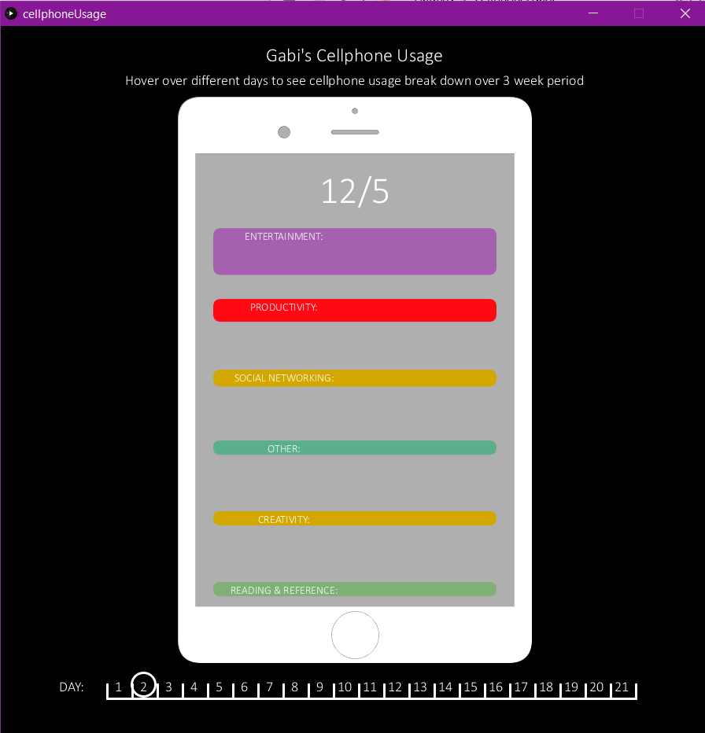
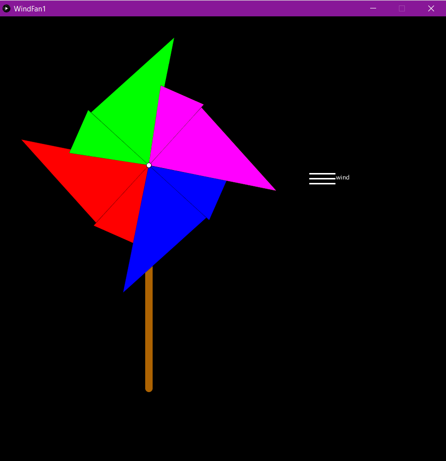

# June 7: Assignment 4

## Part 1

### Synopsis:

The first part of this assignment was to create content using data visualiztion or generative text

### What I did:

I chose to make a data visualization piece that depicted my cell phone usage over a 3 week period.

The final piece can be seen [here](https://www.youtube.com/watch?v=ToxSwd6W2ks)

I went through several steps to make this piece a reality. 

First I chose my data set. I looked around but finally settled on the data gathered in Screen Time on my phone. I was interested to see how this data could be used to create something interesting

Once I settled on the data set I inputed it into excel and made a rough plot to see if there were any trends from my data. I believe that data visualization should be used to tell a story with the data so I wanted to know if my data said anything.

As shown in the photo, the data didn't show any significant trends. Therefore I thought it would be interesting to visualise the data in a way that reflects where it came from rather than one particular trend.

At this point, as usual I made a sketch of what I wanted to do and did some rough calculations.

After this I inputted the data into Processing using JSON commands. I tried using csv commands but then shifted to JSON as my data comprised mutiple data for the same day much like the case in object orienting programming. In this way JSON was a better solution. 

With this format I did my first test of visualizing the data by using a single field that showed different days based on the x position of the cursor. A clip of this test can be found [here](https://www.youtube.com/watch?v=1fvFha4cpks).

After this step, I moved on to accessing mutiple fields for multiple days. The test for this can be seen here: [test 2](https://www.youtube.com/watch?v=EK-lpDpkTHw)

Once I was able to accurately manipulate the data, I worked on the background which would look like a phone. 

After this I made the data fit within the phone as notification bubbles and completed the second to last test -  [test 3](https://youtu.be/l0IsZjq5-Ww) of my visualization. 

Finally, after having my roommate user test, I implemented his feedback and added some finishing touches that led to the final product

### Challenges

The first major challenge was interpreting the data. This  was a problem because, as stated above, my data was not appropriate for csv and worked more efficiently with JSON. However since we spoke more about csv commands in class I had to take some time to familiarize myself with JSON. However, due to processing's clear reference guide, it was pretty straight forward.

The second challenge was lining up the notification boxes. To be honest I still haven't really figured this out and had to work around it. I wanted the notifications to line up one below the other but this required me to return values from my individual functions of the height of the notification before it. However, I had a lot of trouble getting this to work properly either with the return value and the correct spacing between notifications or both. Eventually I decided to give them equal amount of space between each box and map their values based on that space. This was the major difference between how test 2 and test 3.

### Reflection

I liked this assignment but I wish my data were a bit more adaptable. Due to the fact that I had spurts of binging neflix on my phone, the data had a very huge range which did not translate well in the small notification bubbles. However, I was still more or less pleased with the result.

## Part 2:

### Synopsis: 

This part of the assignment was to create an art piece that used transformations

### What I did:

I decided to create a wind fan as I felt like it could use translation, transformationi and scale. Using all three transformation commands, I drew the fan. After that, I used rotate to let the fan spin.

Once I got the basis of the shape down I wanted to make the animation more complex by letting the fan increase spinning speed as if the wind controlling it was increasing. As such I used scale and rotate to create the effect such that when the mouse was pressed, the wind strength grew and the fan spun more quickly. Once the mouse was released, the wind speed would go back to it's default size and the fan would gradually decrease until returning to default speed.

The final product can be seen [here](https://youtu.be/WdJMk67mYO0)

### Challenges

My biggest challenge with this project was making the fan maintain a max and min speed for the fan so that it does not spin out of control or completely change direction (respectively). In the end I realised I was over complicating the process and just needed to use a nested if statement. 

After that, my next challenge was choosing an appropriate max speed. This was a challenege because first I used 360 degreed and then 180 degrees both of which did not work because they rotated so rapidly that they either didn't have an effect or just blinked out of control. In the end once I used a better max value with a bit of an offset it worked fine. 

### Reflection

This part of the project was beneficial because I completely understand the purpose of push() and pop() now. With the help of the Dan Schiffman tutorials assigned for homework and the assignment I better understand it's use and how to implement it in my code. If I were to extend this project I would play with colors and shading to make the fan more realistive and add a better wind graphic. Besides that it was a fun task

