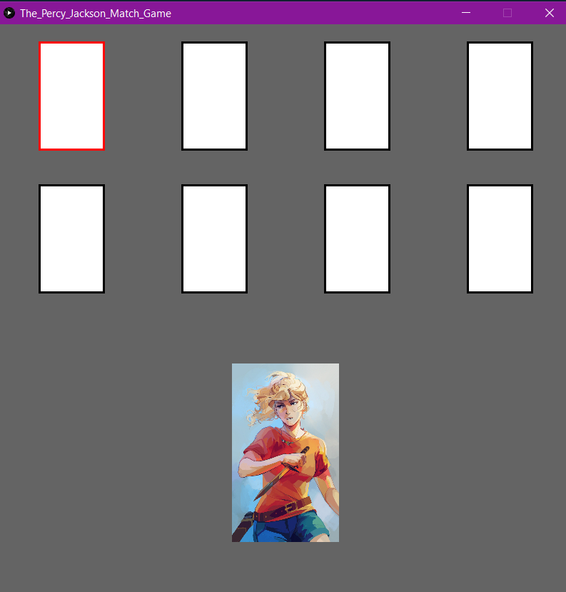

# June 8 - Assignment 5

## Synopsis

The purpose of this task was to create something using images

## What I did

I used a collection of fan art done by [Viktoria Ritzel](https://riordan.fandom.com/wiki/Viktoria_Ridzel) to make a simple card game using characters from my favorite childhood series - Percy Jackson and the Olympians.

The final product can be found [here](); 

The player could move using arrows and can select a card by pressing 'shift'. Once the correct card is selected, it is displayed. The game can be refreshed at any point with the cards being reshuffled on mousePressed.

## Challenges

My major challeneges were created the grid of photos which I was able to get around by using a separate index for the photos from the grid itself. In the end I didn't need it however as the images only displayed if it were a match.

Another problem I had was displaying the winning image without it disappearly quickly. I combatted this by using a conditional function but I think there must be a more efficient and clean way to do this. 

Finally I was having problems with the key pressed function for ENTER. It was not working consistently. This is the reason I shifted to SHIFT for submission of card.

## Reflection

I will admit that this is not my best work. Due to the fact that I was feeling under the weather today I found it difficult concentrating and debugging was extra long and tedious. Given the time I would want to elaborate on this project making it more clean, user friendly and engaging
