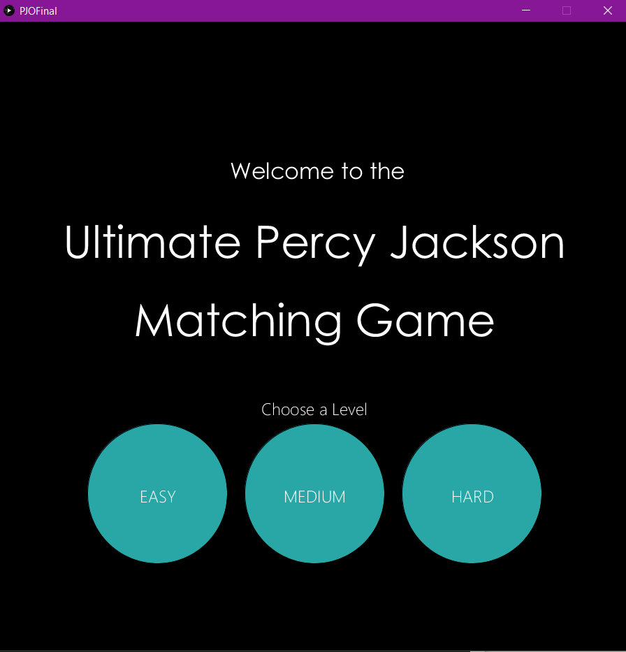
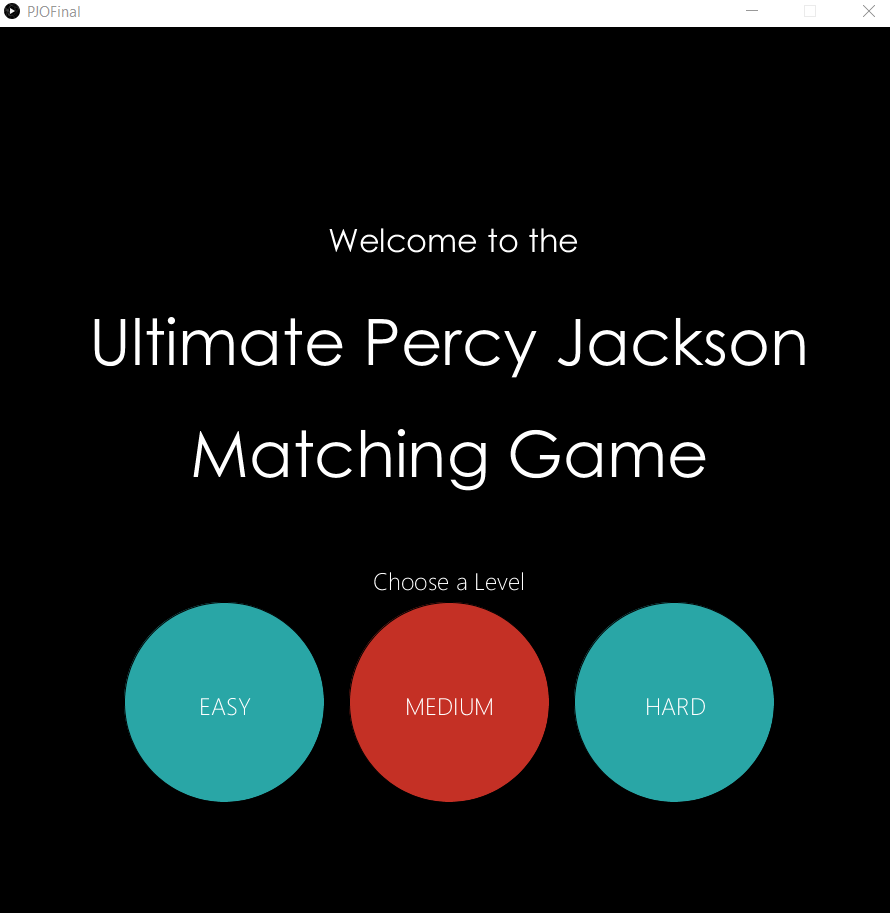
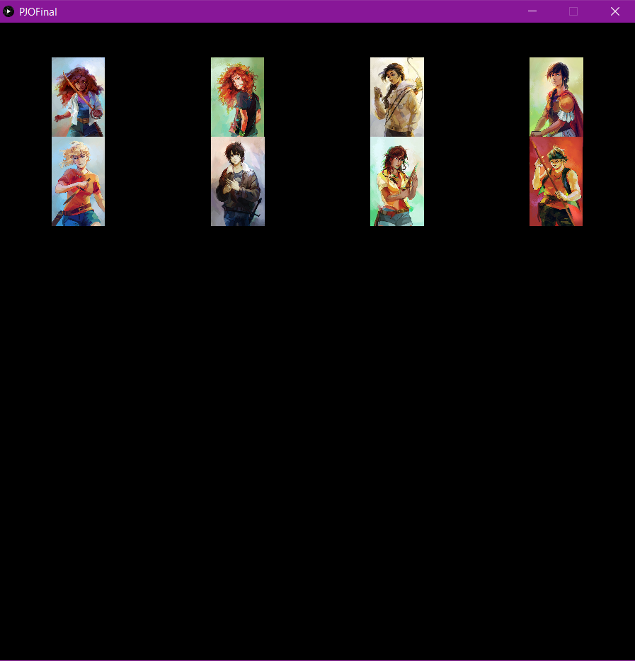
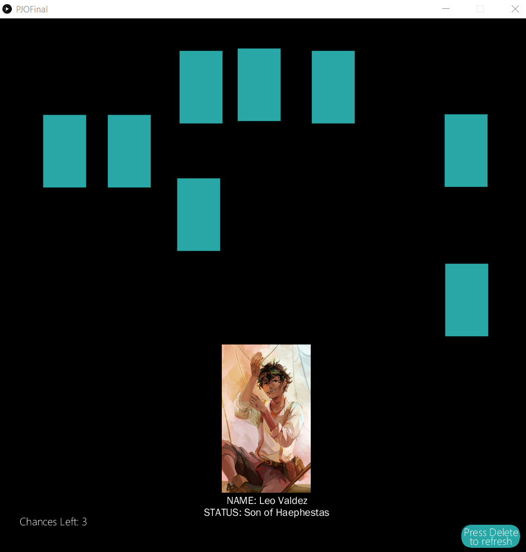
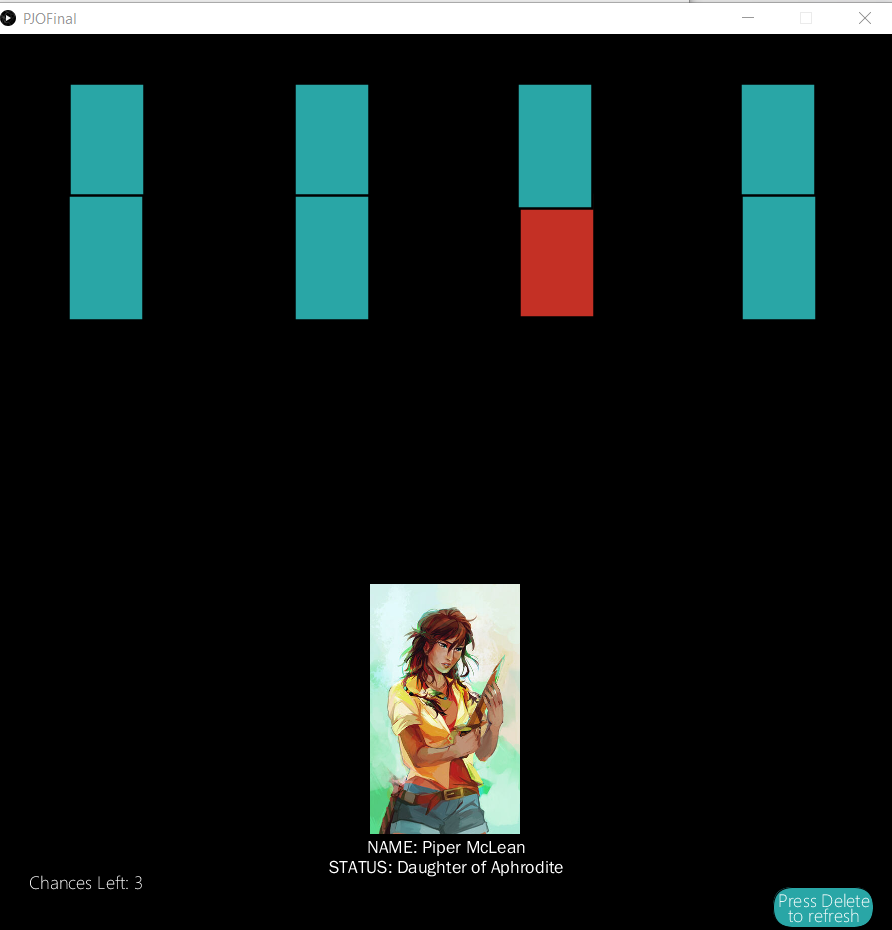
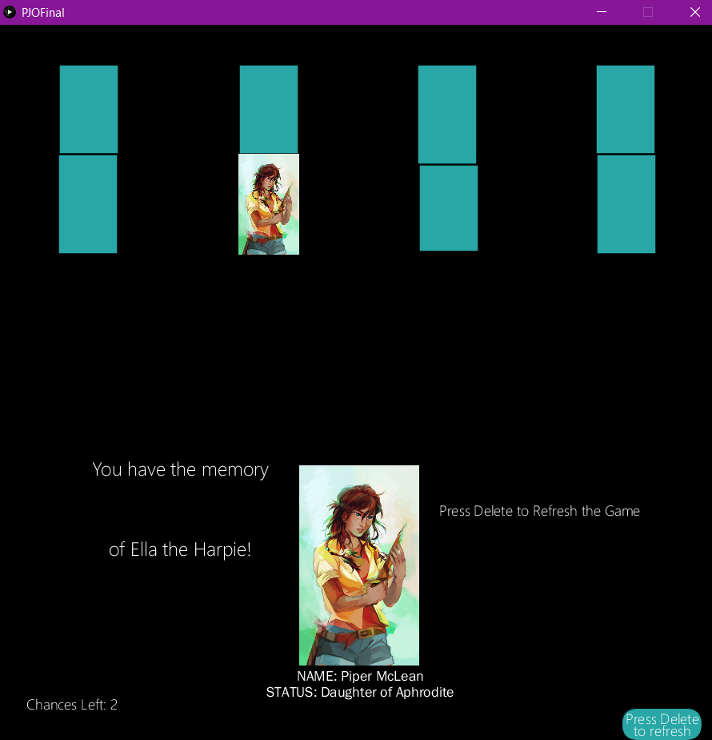
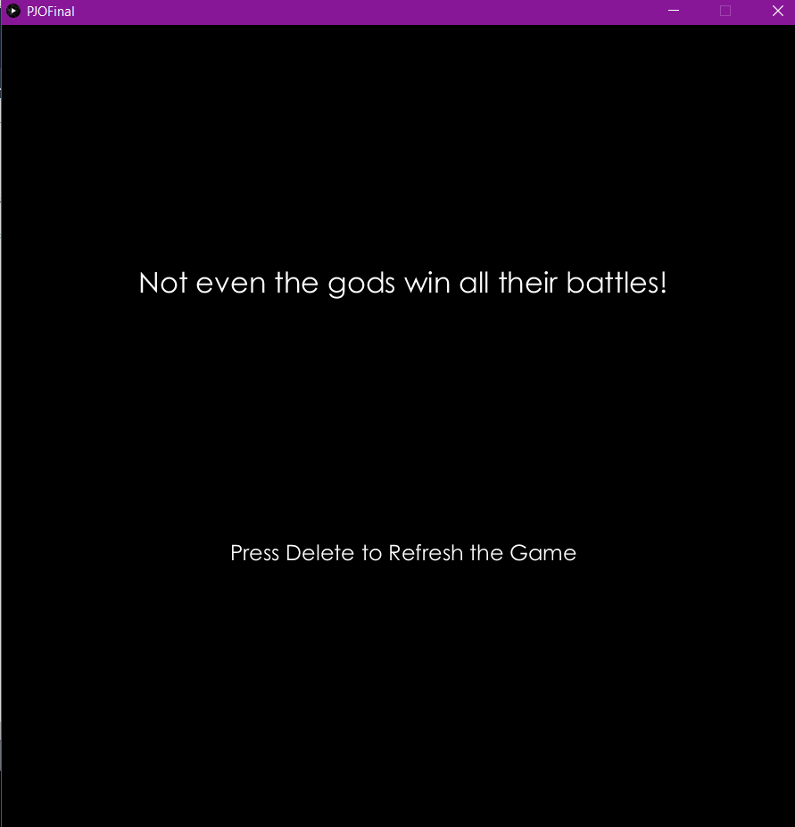

# Midterm Project: 
  # The Ultimate Percy Jackson Matching Game!
 - June 10th 2020

## Synopsis

The task for the midterm was to create a game that uses everything we have learned so far

## What I did

I decided to improve my game done for assignment 5 - The ultimate Percy Jackson Matching Game.

The final game can be found [here](https://youtu.be/dx2TxDyScK8)

  This project took a lot of time and had quite a few parts. As such I decided to break it down into smaller tasks and work on them in a joint order of difficulty and priority. 

As with all my projects I started out with a sketch. I have found sketches to be quite useful in breaking down a task and getting a wrap on my ideas. 

This skecth was more like a wireframe as it also served as my flow chart for how the game should transition. 

The first thing I worked on was the welcome page and the ability to make the levels be dynamic by changing color when hovered over

This was both a fairly easy task while still being quite an important element to me 

After this I worked on the body of the game. I first focused on getting the cards so display based on their levels but I took a back seat on this once I was making decent progress as I saw having multiple levels was not as important as having the game actually running. As such while working ont he levels I was also working on the shuffle which porved really difficult

Once this was completed, I applied a similar logic to the welcome page to the game such that the cards turned red when hovered over. Unlike the first version of this game I worked out how to use mousePress to pick your card. Since I was using classes this time it was much easier. The doorbell example from Dan's Schifman's Library also proved really helpful.

I also decided to add information on each of the heroes using a JSON file to include what we learned about inputting data from an external file

Finally I had to work on the winning and losing actions once a card was submitted. I decided to add sound at these points as I thought it was more appropriate that having a background tune throughout. 

Getting the winning and losing pages to come up initally proved difficult but as with inserting the welcome page I made use of conditions to only allowed them to be played conditionally. I wanted the winnind message to intentionally display on the game so that the winning card remains. I could have imporved the display of the text however. Nevertheless it came out pretty well. 

## Challenges

One of my biggest challenges were keeping track of all the variables as my code grew. This especiailly became an issue when i got an error. To overcome this I would often do a stepwise process of testing each function in order and seeing when the code breaks. I also did parts of the code in separate sketches and then added them to the main code adjusting as necessary once it was working independently.

Some of the coding challenges included: 
- getting the cards to display for a few seconds before being covered

  This seemes to be a problem I am facing a lot as processing seems to load everything in a function before displaying. I am learning to use framecount to manipulate this and conditions but I am curious to learn more robust ways of delaying parts of a project
  
- moving the cards to their new position
  
  This was bothersome as I had to ensure that the x and y locations matched. Using arrays helped me to overcome this problem. However, even after getting the settings right I still had problems of some cards not stopping. Michael helped me fix this however by bringing to my attention the fact that unless I use a range to detect the new location some cards may miss their new position completely. This was very useful advice and both solved this problem and other mouse pressed issues.
  
- shuffling the array without duplicating elements from the array 

  This was a problem as I didn't know how to sort the cards without using random. However, I was saved by processing reference page that explained arrayList and its functions, one of which being ... shuffle!. Using an array list I was able to shuffle the integers and place them in a new array without any duplicates
  
- displaying certain pages/messages conditionally within draw

This goes back to my first challenge of having to use conditions to prevent certain parts of the code from running. I hope I can address this in the future

- playing music without it crashing
 
 The music crashed because every time draw happened it would restrat which just produced a horibble statc like sound. In the end I was able to resovle this by making it play only within a function that was conditional
  
  *In essense most of my challeneges were resloved by enough conditional statements... not the most robust method but definitely efficient in my case.*

## Reflection 

This exercise really helped me see code more holistically. Looking back I would do well to comment more regularly so that I do not get lost within my own code. However, overall I tried to make the game and the code user friendly. I also made it a point of duty to try to figure out how each element of the game would work on my own with little to no openSource code. I thought this would make me better understand what I was trying to do and learn from my mistakes. 

All in all, taking into consideration the amount of time we had to complete the assignment, I am pretty pleased with the project.
