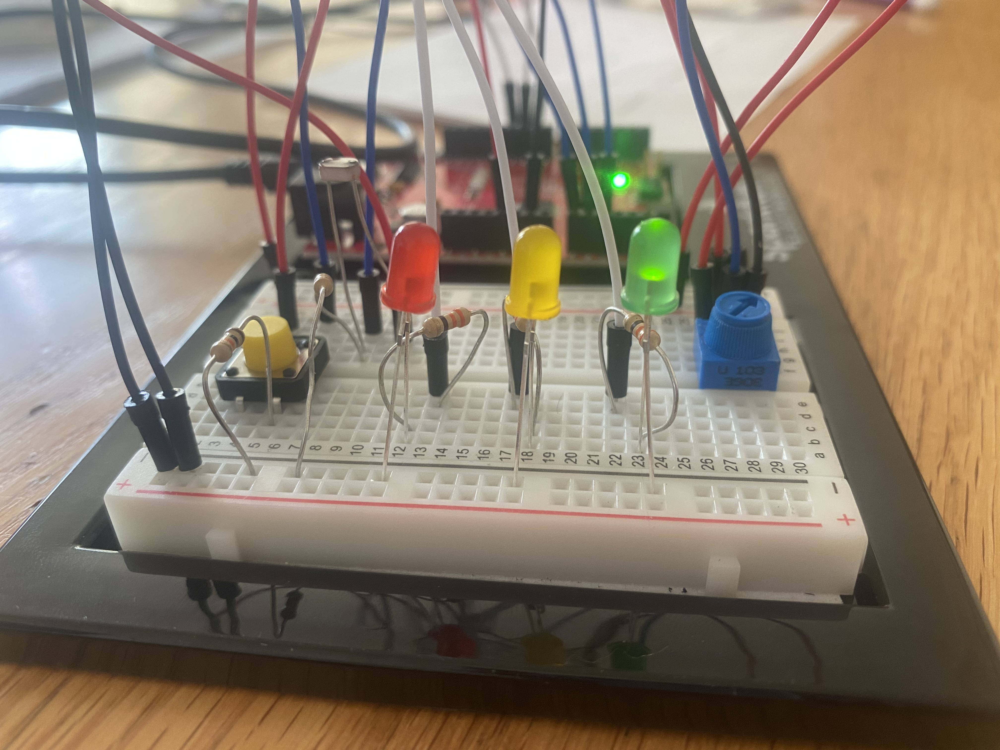

# June 16 - Assignment 8

## Synopsis:

This assignment was to use LEDs, and sensors both digitally and in analog fashion in a creative way

## What I did:

I chose to simulate a traffic light such that I put a red yellow and green LED to light up one after the other.

As with traffic lights the each light shines for a different variation. As such I made all three lights flash for a different lengths. However while I kept the amount of time between each light proportional, relying on the assumption that traffic lights in different places last for different times, I used the potentiometer to determine the delay of all three lights. 

After this, I used a switch to manipulate the brightness of the LEDs such that when the switch is pressed the lights gradually become brighter and when released they gradually dim until reaching the default brightness for this code. 

Finally, using the photoresister, I programmed the traffic light to only run in a certain range of light. If the photoresister is exposed to too much light, the LEDs turn off. This feature was added to provide a sense of energy preservation in an environment where the light from the LEDs would barely be visibile anyway and to satisfy the requirement of having digital output.

The final project can be found [here]().

### The Schematic:

### Pictures of the circuit:

## Challeneges

In the grand scheme of things this was not a difficult task. The two main challenges I faced was :

- Integrating digitalWrite
 
  This was difficult because for my vision, all three of my LEDs required analogWrite. In essence I didn't really need digitalWrite. However, the fact that it was required prompted me to think outside the box. I took Michael's suggestion of using the resistive sensors to manipulate the digital outputs and in the end decided to use the photoresister to run the program and if the condition was not met, use digitalWrite to turn off the LEDs.
  
 - Integrating the switch for brightness.
  
  This was initially a challenge as I had the iff statement for the switch separate from the transitioning frokm one LED to another. Since the code was read chronologically, the brightness wasn't changing until after all the delays. I fixed this by integrating the condition into the body of the traffic Light functitons. It still isn't as smooth as it could be due to the delays but it does give a better effect than my inital try.
  
  ## Reflections
  
  This was a fun exercise to refresh building circuits and how to use inputs and outputs. Additionally while Arduino is very similar to processing, there are a few things that play out slightly differently and this was a good assignment to adjust my perception of code
