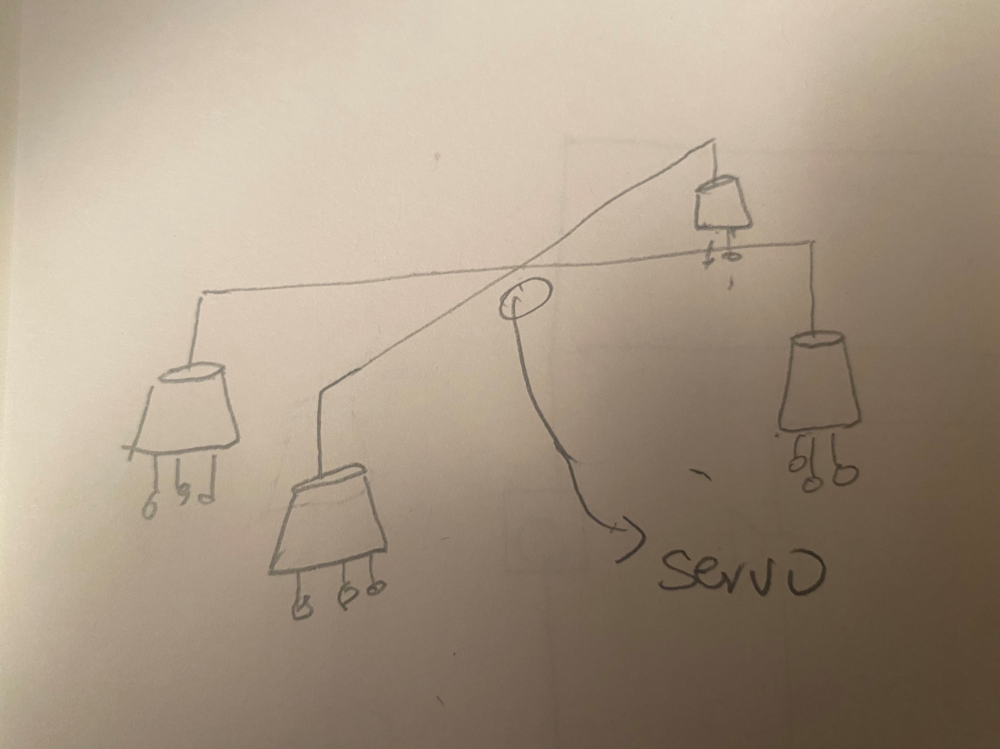
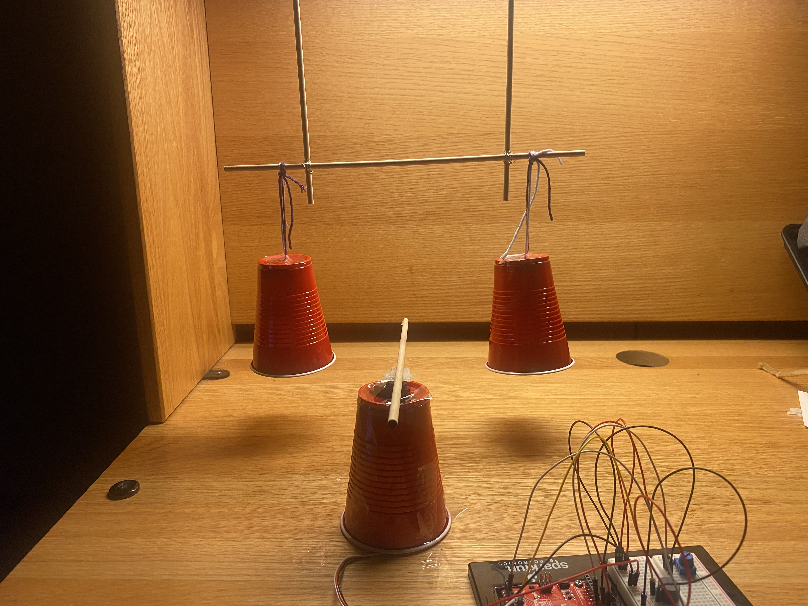
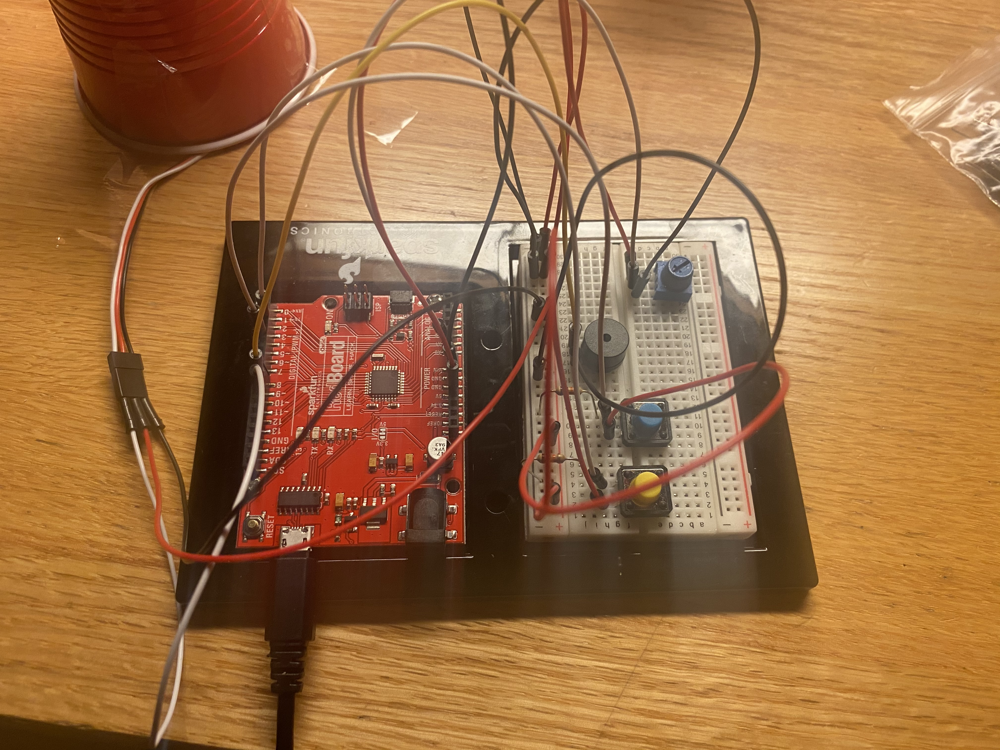
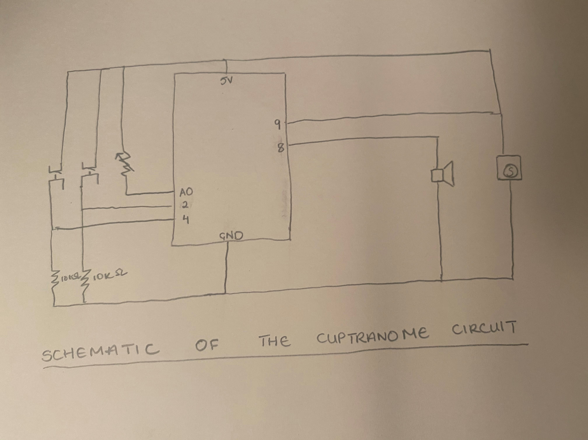
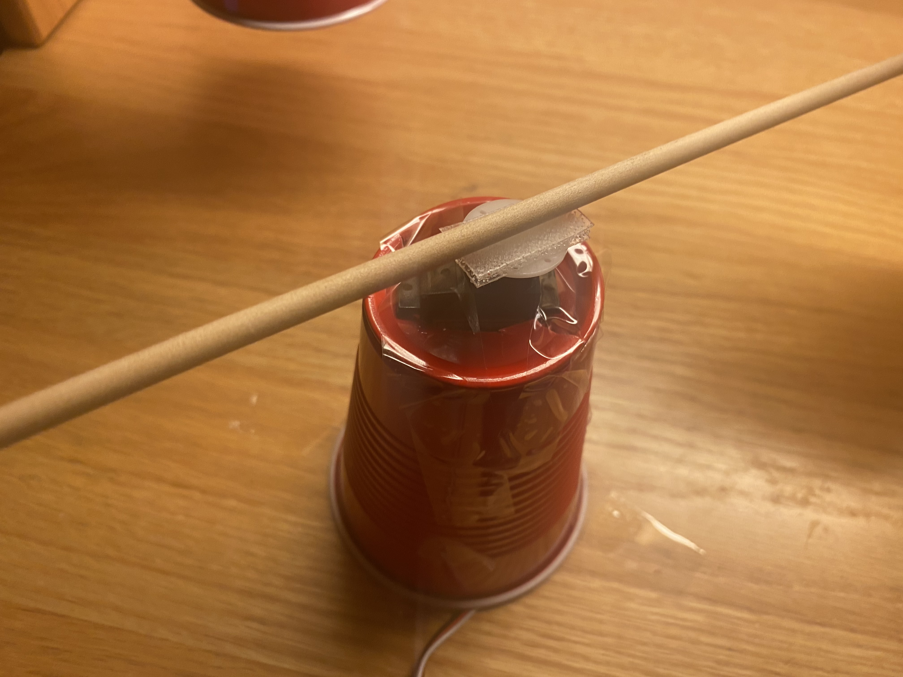

# June 17: Assignment 9

## Synopsis: 

The task was to create an instrument that included one analog input and one digital input

## What I did

I used this opportunity to start using odds and ends around the house. Given my limited resources I challenged myself to find a creative way to use the few things I have in my New York dorm room. 

This led to the Cuptranome! The cuptranome is an instrument that is a cross between a metranome and a percussion kit. It comprises 3 cups, buttons, a servo motor, two switch buttons and a speaker. 

The final product could be found [here]().

This first thing I did after gathering potential objects was to make a sketch.

At first I wanted to make something similar to a wind chime but concluded that the servo motor wasn't strong enough to support 1 cup, let alone 4. This is when I decided to have the cups chimes hanging and use the servo motor to hit them. 

A video of this first trial can be found [here]();

Once this was complete, I wanted to use the potentiometer to manipulate the speed of the servo to mimic a metranome. This was also the point when I came up with the name cuptranome. A video of this step can be found [here]()

Once this was complete I added buttons with different pitches to serve as a sort of cymbals (or at least contrasting chromatic notes). The notes were output through the speakers. With this my circuit was complete.

Here is the schematic:

I fortified the servo motor by nesting it into a cup and taping it to the table. This allowed for both hands to be free to add the cymbals and change the tempo simultaneously.

## Challenges

I have heard Michael say time and time again that 'just' mentality is a trap. Today was one of those days when I fell for that trap. After getting the servo and the switches to run separately, I thought I 'just' have to put them in classes and they can run simultaneously so I didn't start on doing that as early as I should. 

This proved to be my biggest challenge and I have actually not solved it. Rather, after trying for hours, I decided to work around it. The challenge was this:

The code worked fine together. However, when I added code to make the servo angle be manipulated by the potentiometer values, the servo would start doing freaky things. A video of this can be found [here]().

<pre>
void Update()
    {

       // start added code that crashes servo
       int tempoReader = analogRead(A0);
        increment = map(tempoReader, 0, 1023, 1, 5);
        // end

      if ((millis() - lastUpdate) > updateInterval) // time to update
      {       
        lastUpdate = millis();
       
        servo.write(pos);
        pos += increment;// tell servo to go to position in variable 'pos'
        Serial.println(pos);
        // waits 15ms for the servo to reach the position
      }
      if (pos < 0 || pos > 90) { // goes from 0 degrees to 180 degrees
        // in steps of 1 degree
        increment = -increment;
      }
    }

</pre>

In the end I made a class just for the speaker and inserted a function to check if button was being pressed in the main body of the code along with the code to manipulate the servo.

## Reflection

This assignment was a reminder to not put off what I could do now for later as you never know when a seemingly small task can stump you for hours.

