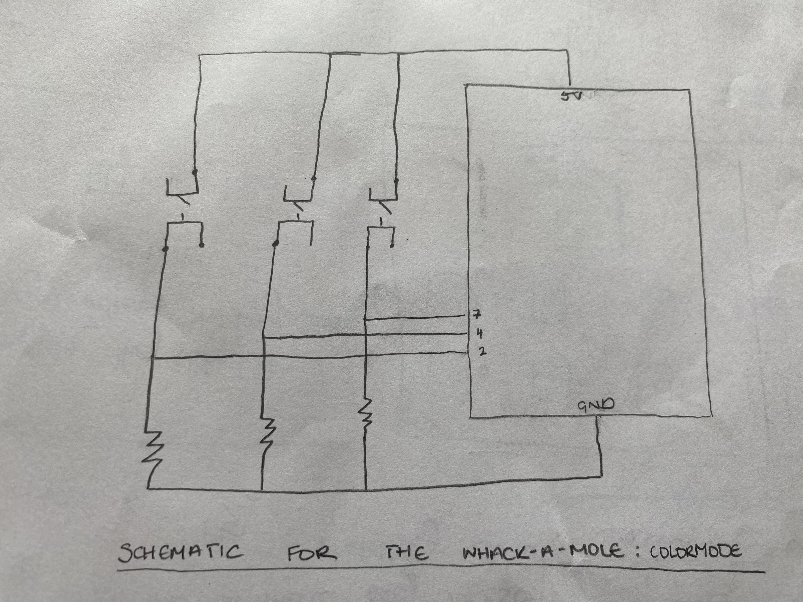

# June 21: Assignment 9 - Whack-a-mole: ColorMode

## Synopsis:

This assignment's task was to make a simple game that involves some kind of communication between Arduino and Processing.

## What I did:

For this assignment I chose to make a Whack-a-Mole game that uses the switches to whack the mole in it's corresponding hole on the screen.

A video of the game being played can be found [here](https://www.youtube.com/watch?v=4bKlcomM5Ws) After receiving feedback from my user I added a sound effect which can be heard in the [screen recording](https://youtu.be/SxN8H6eZni0) of the game.

I knew that I wanted to do a whack-a-mole game with the switches but I wasn't exactly sure how to go about it. At first I planned to flip between drawing the hole and drawing the mole but it wasn't very efficient. I decided to look for references online and actually found a whack-a-mole [openProcessing sketch](https://www.openprocessing.org/sketch/106739).

I used this as a guideline in making my own game. The game was particularly helpful in going from one hole to the other but besides that I worked out the other elements more organically once I was got the delay for the holes working.

This is the first assignment that I didn't make a sketch for but I did look up videos of a whack-a-mole games to understand how the game works more acurately. 

Firstly I designed the processing page so that the moles popped up randomly. 

After this I created the arduino code and the circuit. 

Once this was completed I made the two programs communicate with eachother and stored the score if the correct button was pressed.

A video of this could be found [here](https://youtu.be/6lY-xYGD9LY)

## Challenges

The largest challenge I had was getting the score to only increment once when the button is pressed but I used conditionals to overcome this. 

Additionally, a very trivial problem but proved to be quite frustrating. When I first started the mole would appear at 0 even though it was initialised to be at width/6. Turns out that this was because I set the value before declaring the size. Once I assigned the value in set up instead of outside the function it worked smoothly

## Reflection

This assignment helped me to come to terms with using referecnce and open source code in making my projects. I think I was avoiding this as I didn't want to fall into the trap of using code I didn't fully understand (which is how I got so far in IM without taking intro aha). I wanted to make sure I understood the fundemental concepts before leaning on external source code but now I think I have reached a point where I can balance this problem and feel confident in my understanding of coding

