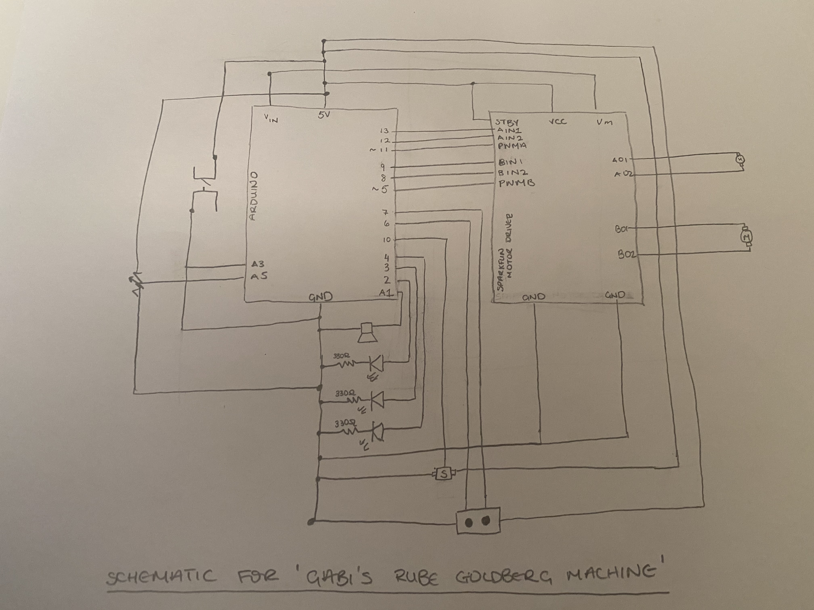

# June 24: Final Project
## Gabi's Rube Goldberg Machine

## Synopsis:

The final project is meant to encompass a combination of the skills we learnt throughout the course and use both Arduino and Processing to make this happen

## What I did:

From the beginning I was interested in making some sort of obstacle course. After some reflection I decided that I wanted to go more along the lines of a [Rube Goldberg Machine](https://en.wikipedia.org/wiki/Rube_Goldberg_machine). ALso known as the Chain Reaction Machine, these machines comprised indicidual elements then when put together triggered a sequence that ideally completed a task (for example [pour a glass of milk](https://www.youtube.com/watch?v=EjOFeC-Dm7U). 

I wanted to use physical computing to create an electronic Rube Goldberg machine where sensores triggered actuators which triggered more sensors and so on. 

A fecording of the final product can be seen [here](https://www.youtube.com/watch?v=UUDMFtEI5ZE&list=PLby9sGn7NkDsPRaJ7ijuivusO_0132BwO&index=1)

As sketch of my preliminary idea can be found below:

Once I had my sketch I broke my project down into smaller elements and got them to work separately before combining them together. The individual elements were:

  - Switch to start the machine
  - Pulley system using motor
  - Photoresister to trigger motor
  - Servo to push an object
  - Ultrasonic sensor to measure distance moved by object
  - Motor to create rotaery to linear mechacnism and bush a button*
  - LED's to glow in sequence
  - Speaker to signify end
  - Processing sketch to determine time elapsed
  
  
* While I was able to get most of these elements up and running the motor to button did not work as the motor was not strong enough to apply sufficiant force to the button.

A [video playlist](https://arduinogetstarted.com/tutorials/arduino-ultrasonic-sensor) of the process of making these elements  was compiled and shows how they all come together to create the final product.

The following pictures show the piece in its entirety. Considering how much time we spent discussing design in the past month, I thought the least I could do it make the machine somewhat presentable. As such once can see the transition from the first board to the final which has a cleaner feel 

This is a photo of the box and the rough outline of where components would be placed

This is a photo of the machine after the route has been completed.

Given the various elements involved in the project the schematic also have many components as seen below: 

Finally once the machine was triggered, the processing sketch started a timer and ran until the third tone is played on the speaker at which point the screen pauses and changes color

## Challenges

As apparent by the schematic, there were many connections and was quite difficult to follow. This project proved challengning as it seemed like everything I fixed one component, another component would act up. The most efficent (though still time consuming) way to track errors was to label the pins and put them in one by one checking to see if the previous componenets still worked when a new element was added. To stay on track of the pins I taped like pins (eg motor A pins) and kept a checklist

By the end of it I got over all my phyical challeneges.

Speaking of physical challenges, two major challenges proved to require patiences and intuitiveness. 

The first one is something I should have caught and surprisingly took long for me to realise - Servos/DC Motors.

For most of the time spent on this project I couldn't get there servo to work. it would run independently but when I added the code to the main program it wouldn't work. I even took it out and debugged it part by part. In the end the problem was that I was attaching my servo in my constructor when I should have made a method for attaching it and letting them do it in class. However, the moment I solved this problem the dc motor crashed. After some research I realised that it wouldn't work as I had my PWMB pin in pin 10 which is disabled, along with pin 9 when the servo library is included. 

The second most challenging aspect had to deal with getting by without a soldering iton, insulated wire or even a host glue gun. I was adamant on having a proper machine however and so fiddles with different ways to insulate and connect wire going from tape to cling war and finally settling on yarn. I have considerable amounts of yarn left from a frend so I wrapped each wire around with yarn to ensure proper insulation. This maid my breadboard and my machine quite messy but it was by far the best solution. 

A photo of the breadboard with all the wires

Besides the fact that the button could not be pressed, another challenge was applying the mechanism to turn rotary motion into linear motion. Again because of my limited resources by components weren't extrememly fortified and by no means accurate. As such in the linear motion varied in precision and sometimes well of the circular hinge. 

The first prototpe was to heavy and the other components could just barefit. As such I had to create a more user friendly prototype that I settled for in the completed version. The final prototype was a mixture of motor, cardboard, tape and pipecleaner

The next challenge was pretty minor, because the cup used to roll towards the ultrasonic sensor was unblanced, it often prevented the cup fro getting too the end. SHould I do this again, with the proper resources then this should be none question.

Finally, the challenge I have not yet meen able to fix is the LED sequence. Alone of even within the main code with certain elements commented out, they responded indivdually. However, once I ran the whole code in it's entirety the LEDs all sync up and I'm not sure why. A snippet of the code can be seen below.

<pre>
class LEDs
{
    int ledPin;                                                 // variable for the LED pin

    unsigned long previousMillis = 0;                           // will store last time LED was updated

    long interval;                                              // interval at which to turn on (in milliseconds)

    // constructor method
  public:
    LEDs(int pin, int pauseVal)                                 // takes in pin value and interval value
    {
      ledPin = pin;
      interval = pauseVal;
      pinMode(ledPin, OUTPUT);                                  // sets pinMode for each LED
    }

    void ledON() {

      unsigned long currentMillis = millis();                   // stores the current time in ms

      if (currentMillis - previousMillis >= interval) {         // allows for a delayed reaction without using delay()
        previousMillis = currentMillis;                         // save the last time you blinked the LED
        digitalWrite(ledPin, HIGH);                             // turn on LED
      }
    }
};

</pre>

I know the code works as I have tested itbut I don't know how to fix my problem anyway. Hopefully at some point I will be able to rectify it

## Reflection

Given the limited resources and short time frame I had to complete this project I am proud of the outcome. I am surprised and how resourceful one can become if necessary. I have stronger appreciation for the IM lab and how accessible and open it is. Nevertheless I enjoyed working on this even if at times it was frustrating because ultimately it was a learning experience.

  

